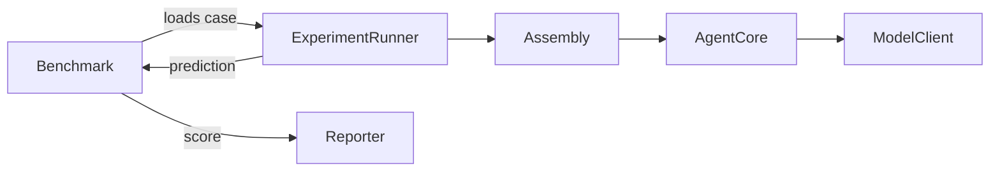
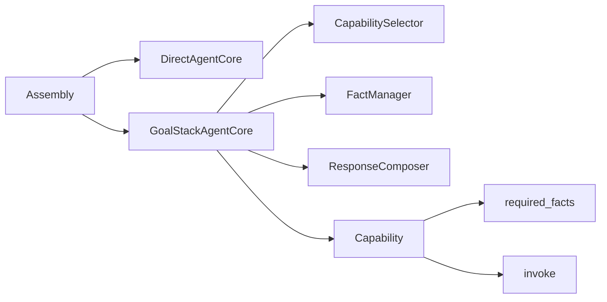

# agentweave

AgentWeave: Experimenting with functional agent architecture for search, tools, and structured LLM workflows.

This repository is a first-pass scaffold for benchmarking agent architectures and benchmark adapters. It currently includes core abstractions, Python-defined assemblies, Python-defined benchmarks, synthetic capabilities, a direct fake-model path, and a runnable synthetic smoke benchmark.

The first pass does not implement the GoalStack planning loop. `GoalStackAgentCore` exists as a placeholder, but the working path uses `DirectAgentCore` with `FakeModelClient`.

The main runtime shape today is:



Assemblies are Python-defined compositions. Benchmarks are Python-defined task and scoring modules. Capabilities, fact management, capability selection, and response composition are defined as small, testable components with a direct synthetic implementation now and a GoalStack-shaped placeholder for later.

Current component map:



Planned extension points are stubbed for future τ-bench airline/retail support and BFCL support. Those adapters exist only as placeholders in this scaffold.

To run the smoke benchmark:

```bash
python scripts/run_experiment.py --assembly fake_direct --benchmark synthetic_smoke
```

Expected output:

```text
synthetic_smoke vs fake_direct: 3/3 passed
Report: data/reports/synthetic_smoke__fake_direct.json
```

The repository intentionally does not include LangChain, LangGraph, YAML configs, an `AgentTask` abstraction, an `AgentRuntime` abstraction, a global capability registry, or a programmed `FactState`.
